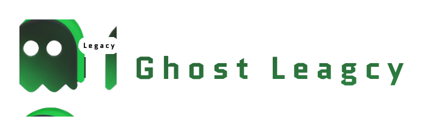
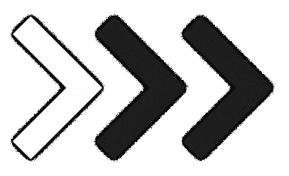
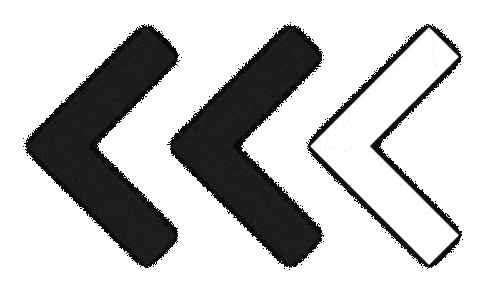

<h1 align="center"></h1>

  
Convert high fidelity mockups to skeleton placeholder.

  

# Installation

Click the button below to try out this plugin from Figma community

<picture id=arrow-n1>
  <source media="(prefers-color-scheme: dark)" srcset="src/assets/decoration/chevron-animated-right.gif">
  
</picture>

<picture id=arrow-n2>
  <source media="(prefers-color-scheme: dark)" srcset="src/assets/decoration/chevron-animated-left.gif">
  
</picture>

# Usage

## 1. Ghost-legacy > Solid

Select One (1) or more layers and run the plugin.

For the Type, choose Solid and for the Color choose one of the three existing proposals (Gray, White, Black) or enter a color name X11 or enter a valid hexadecimal value

Note: in the case of an invalid color entry, no action is taken (the interface remain the same)

## 2. Ghost-legacy > Gradient

Select One (1) or more layers and run the plugin.

For the Type, choose Gradient and for the Color choose one of the three existing proposals (Gray, White, Black)

> Note: currently you cannot enter a color name X11 or hexadecimal value

# Object handled

- RECTANGLE
- ELLIPSE
- STAR
- POLYGON
- LINE
- TEXT
- SHAPE_WITH_TEXT
- GROUP
- FRAME
- COMPONENT/ INSTANCE

# Support

You find this plugin useful ?   Please consider making a donation to support 🙏🏼

# Code

### Quick Setup

- Clone the repository.
- `npm install` installs all the dependencies.
- `npm run build` builds and bundles the plugin.
- Import manifest into Figma and test.

### Contribution

Contributions are welcomed, feel free to make a pull request or create an issue

# Credits and Thanks

Legacy version - Maker : [@mrstev3n](https://github.com/mrstev3n) & [@rickfaf](https://github.com/rickfaf)

- code sanitization
- add new parameters with custom color support
- figjam friendly
- documentation

Origin version - Maker : [@ckark](https://github.com/ckark)

- lightweight plugin to convert selected layers to solid or gradients

# End Notes

We recall that this is an upgrade of the same good work initially done by Chris Kark on [Ghost](https://github.com/ckark/ghost). We worked on improving the plugin, making it faster and bringing some additional features.

# Meet me in the browser

