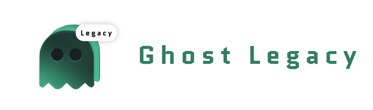

<h1 align="center"></h1>

  Convert high fidelity mockups to skeleton placeholder.

 

# Installation

Click bellow to install the main version from figma community [Legacy version Coming Soon]

# Usage

## 1. Ghost-legacy > Solid

Select One (1) or more layers and run the plugin.

For the Type, choose Solid and for the Color choose one of the three existing proposals (Gray, White, Black) or enter a color name X11 or enter a valid hexadecimal value

Note: in the case of an invalid color entry, gray is taken by default

 

## 2. Ghost-legacy > Gradient

Select One (1) or more layers and run the plugin.

For the Type, choose Gradient and for the Color choose one of the three existing proposals (Gray, White, Black)

> Note: currently you cannot enter a color name X11 or hexadecimal value

 

# Object handled

- RECTANGLE
- ELLIPSE
- STAR
- POLYGON
- LINE
- TEXT
- SHAPE_WITH_TEXT
- GROUP
- FRAME
- COMPONENT/ INSTANCE

# Support

Do you find this plugin version useful ?   please consider to make a donation to support 🙏🏼

# Code

## Quick Setup

- Clone the repository.
- `npm install` installs all the dependencies.
- `npm build` builds and bundles the plugin.
- Import manifest into Figma and test.

### Contribution

Contributions are welcomed, feel free to make a pull request or create an issue

# Credits and Thanks

Legacy version - Maker : [@mrstev3n](https://github.com/mrstev3n) & [@rickfaf](https://github.com/rickfaf)

- code satinitization
- add new parameters with custom color support
- figjam friendly
- documentation

Origin version - Maker : [@ckark](https://github.com/ckark)

- lightweight plugin to convert selected layers to solid or gradients

 

# End Notes

We recall that this is a fork of the excellent work of Chris Kark, that we have improved and have seen fit to share with the community.

# Meet me in the browser

